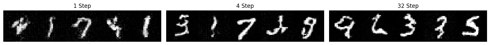

# Pytorch Implementation of Shorcut Models

此处是基于DiT-S/2的Shortcut Models的Pytorch实现，其中部分代码实现参考于以下仓库：

https://github.com/yukara-ikemiya/modified-shortcut-models-pytorch

Pytorch实现并训练模型的权重已发布于Google网盘上，链接如下：

https://drive.google.com/drive/folders/1H3M5WDKklKjvboK4xiUfVed3r7-Aijgf?usp=drive_link

## 环境配置

```bash
pip install requirements.txt
```

## 训练

训练所需参数已在`configs`文件夹中配置，运行`my_train.py`文件即可:

```bash
python my_train.py
```

# 图像生成

将Google云盘中的模型权重文件放置在`output/DiT-S2_shortcut_gamma10000_step50000/ckpt/latest`文件夹下，运行inference.py文件:

```bash
python inference.py --step 生成所用步数
```
使用`--disable-shortcut`禁用shortcut，即朴素Flow-matching生成

# 训练日志

训练日志存储于`output/DiT-S2_shortcut_gamma10000_step50000/log.log`中，并在`output/DiT-S2_shortcut_gamma10000_step50000/train`文件夹中存储了tensorboard记录的数据文件。
以下为训练损失曲线可视化，其中Loss_FM为Flow-matching的原始损失，Loss_SC为Shortcut Models中引入的Self-Consistency损失:


此外，在`output/DiT-S2_shortcut_gamma10000_step50000/sampling`存储了训练过程中以2000训练批次为单位间隔采样的模型生成图片。

### 训练1批次


### 训练4000批次



### 训练50000批次


# 最终模型生成样本可视化

